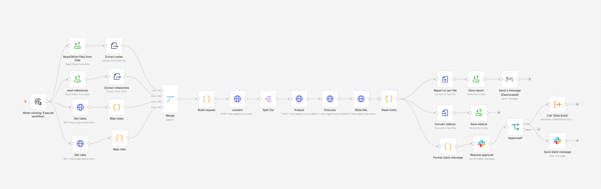
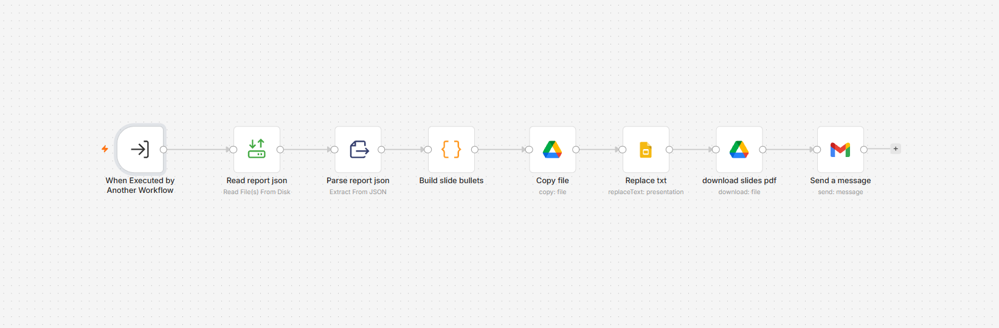

# AI-Drafted Weekly Status Reports, Released Only After a Person Approves

A demonstration build of a weekly program status pipeline. It pulls tasks, risks and engineering notes for a **fictional defense program** ("Meridian Defense Systems C2 Platform"), has three AI agents draft a milestone-by-milestone report, and sends the draft to a person in Slack. **Nothing is posted or emailed until that person clicks Approve.**

Built with n8n (workflow), a FastAPI agent service, Claude (the model), Asana, Slack and Gmail. All program data is invented sample data.

## Why this matters

Status reporting is repetitive, and drafting it with AI is the easy part. The hard part is trusting what goes to leadership. This project is about the controls: a person at the release point, output that stays consistent from run to run, and honesty about which parts are not reliable enough to automate yet.

## How it works

1. **Gather.** n8n pulls tasks and risks from Asana, and reads a milestone reference sheet and free-text engineering notes from a shared folder.
2. **Group.** The agent service groups everything by milestone. This step makes no model call.
3. **Draft.** Three agents run behind a small FastAPI service, each with its own instruction file:
   - the **Analyst** reads a milestone's evidence and returns validated structured output (status, risk, whether the reported status is accurate),
   - the **Executor** turns that into a short narrative,
   - the **Slide-title** agent compresses the result into a slide title.
4. **Approve.** The draft goes to a named approver as a Slack DM using n8n's "Send and Wait for Response". The whole run pauses until they click.
5. **Release.** On **Approve**, the report is posted to a program Slack channel, and a second workflow fills a Google Slides template, exports it to PDF and emails it through Gmail. On **Decline**, the run ends and nothing posts or sends.

The service authenticates n8n with a shared secret, keeps its instruction files as editable markdown, retries once when the model returns malformed JSON, and logs sizes and token counts rather than content. Its test suite uses a fake model, so it needs no network and no API key.

## Getting consistent output

A status report that reads differently every time it is regenerated is not trustworthy. `scripts/repeat_runs.py` runs the same milestone through the Analyst and Executor five times and compares the results on the things that matter: reported status, whether a risk is flagged, sentence count and loaded language.

That process caught a real problem. The Analyst's yes/no "is the reported status accurate" flag came back inconsistently on identical input. The schema was fine; the instructions were ambiguous. It took several rounds of narrowing the instructions, re-running the five-pass comparison after each change, and only accepting a revision once the flag was stable on both known-answer cases. The four saved rounds are in [`runs/`](runs/).

The "known answers" for the two test milestones came from the design conversation and not from an independent source. A third milestone (Customer Demo) has no known answer yet.

## Where it falls short

- **The slide deck cannot be fully automated with this approach.** The Slides text-replace operation can only swap text inside a fixed number of placeholders. The template has five bullet slots, but the generated paragraph varies in length. A light week leaves visible blank bullets, and a long week silently drops the overflow. A parallel attempt driven by a different model hit the same limit, so the ceiling is the technique, not the tool. A real fix means building bullets object by object through the Slides API, which is a different project. The honest design here is that **a person finishes the deck** from the generated titles and bullets. See [`samples/`](samples/) for what the output looks like.
- **A decline is a dead end.** It ends the run without recording why. The approver's reason is collected by n8n and then discarded. A fuller design would route it to whoever owns the source data, since a decline usually means the inputs weren't ready.
- **Only three agents were built.** The original design also described a Planner, more Executors and a Reviewer.
- **The n8n workflow exports are included, with credentials and identifiers removed.** Import `n8n/workflow-1-project-status-reporting.json` and `n8n/workflow-2-slide-build.json`, then reconnect your own Asana, Slack, Gmail and Google credentials and replace the `YOUR_...` placeholders (email address, Slack user ID, Slides template ID, Asana project IDs). Screenshots are in `docs/screenshots/`.
- **Not verified from scratch.** The build was run against an already-running n8n instance. The Docker Compose file in this repository was adapted for public use (a plain local n8n volume) and has not been run in that form.

## Documentation

| Document | What it covers |
|---|---|
| [`docs/PROJECT_SUMMARY.md`](docs/PROJECT_SUMMARY.md) | The full build story: design choices, the debugging trail, the slide-deck finding, and the recommendation |
| [`docs/GUIDE.md`](docs/GUIDE.md) | Architecture, setup, API, n8n wiring notes, security and tests |

## Repository contents

| Path | What it is |
|---|---|
| `agent_service/` | FastAPI service: routes, model wrapper, agent instruction files, tests |
| `n8n/` | The two scrubbed n8n workflow exports, plus the scripts behind the Code nodes (reference copies) |
| `scripts/` | Command-line tools, including the repeated-run consistency check |
| `sample_data/`, `files/` | Invented source data (milestones, Asana exports, notes) |
| `runs/` | Saved output from four rounds of instruction tuning |
| `samples/` | Example generated reports and a sample deck output |
| `docker-compose.yml` | Runs n8n and the agent service |

## Notes

- Keys and secrets are read from environment variables. Copy `.env.example` to `.env`, and never commit `.env`.
- The `N8N_ENCRYPTION_KEY` protects n8n's stored credentials. Keep it safe and never change it after first use.
