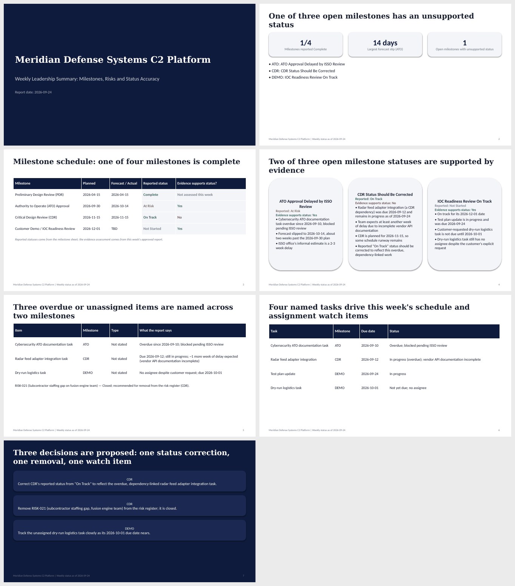

# AI-Drafted Weekly Status Reports, Released Only After a Person Approves

A demonstration build of a weekly program status pipeline. It pulls tasks, risks and engineering notes for a **fictional defense program** ("Meridian Defense Systems C2 Platform"), has three AI agents draft a milestone-by-milestone report, and sends the draft to a person in Slack. **Nothing is posted or emailed until that person clicks Approve.**

Built with n8n (workflows), two FastAPI services (one drafts the report, one builds the leadership deck), Claude (the model), Asana, Slack and Gmail. All program data is invented sample data.

## Why this matters

Status reporting is repetitive, and drafting it with AI is the easy part. The hard part is trusting what goes to leadership. This project is about the controls: a person at the release point, output that stays consistent from run to run, and honesty about which parts are not reliable enough to automate yet.

## How it works

1. **Gather.** n8n pulls tasks and risks from Asana, and reads a milestone reference sheet and free-text engineering notes from a shared folder.
2. **Group.** The agent service groups everything by milestone. This step makes no model call.
3. **Draft.** Three agents run behind a small FastAPI service, each with its own instruction file:
   - the **Analyst** reads a milestone's evidence and returns validated structured output (status, risk, whether the reported status is accurate),
   - the **Executor** turns that into a short narrative,
   - the **Slide-title** agent compresses the result into a slide title.
4. **Approve.** The draft goes to a named approver as a Slack DM using n8n's "Send and Wait for Response". The whole run pauses until they click.
5. **Release.** On **Approve**, the report is posted to a program Slack channel and a second workflow (Workflow 3) builds the leadership deck. On **Decline**, the run ends and nothing posts or sends.
6. **Build the deck.** A separate deck service takes the approved report plus the milestone sheet and has Claude write the slides with code execution and the PowerPoint skill. The service checks the result with 21 deterministic layout and accuracy checks and sends failures back for up to two repair rounds. The first draft is PPTX and PDF.
7. **Approve again, then distribute.** The draft is emailed to the reviewer, who approves it before anything goes to the distribution list. Distribution is **off by default** and needs both a flag and an address list. A decline hands the draft to the reviewer to edit and send personally.

The deck step used to be a fixed Google Slides template (Workflow 2, kept in [`n8n/legacy/`](n8n/legacy/) with its [screenshot](docs/screenshots/workflow-2-slide-deck-and-email.png) and a [sample](samples/Weekly%20Status%20Report%20(sample%20deck%20output).pdf)). Workflow 3 replaces it. This is what the LLM-built deck looks like for the same week, as generated and unedited ([PPTX](samples/Weekly%20Leadership%20Deck%20(LLM-built%20sample).pptx), [PDF](samples/Weekly%20Leadership%20Deck%20(LLM-built%20sample).pdf)):

The service authenticates n8n with a shared secret, keeps its instruction files as editable markdown, retries once when the model returns malformed JSON, and logs sizes and token counts rather than content. Its test suite uses a fake model, so it needs no network and no API key.

## Getting consistent output

A status report that reads differently every time it is regenerated is not trustworthy. `scripts/repeat_runs.py` runs the same milestone through the Analyst and Executor five times and compares the results on the things that matter: reported status, whether a risk is flagged, sentence count and loaded language.

That process caught a real problem. The Analyst's yes/no "is the reported status accurate" flag came back inconsistently on identical input. The schema was fine; the instructions were ambiguous. It took several rounds of narrowing the instructions, re-running the five-pass comparison after each change, and only accepting a revision once the flag was stable on both known-answer cases. The four saved rounds are in [`runs/`](runs/).

The "known answers" for the two test milestones came from the design conversation and not from an independent source. A third milestone (Customer Demo) has no known answer yet.

## Where it falls short

- **The slide deck is "90% there", not finished.** The original template approach hit a hard limit: the Slides text-replace operation can only swap text inside a fixed number of placeholders, so a light week left blank bullets and a long week silently dropped content. Workflow 3 gets around that by having Claude build the deck from scratch each week, which handles variable content. It is still a draft: the layout is sound but not designed, the executive-summary slide can be sparse, and some runs need a layout repair round before the checks pass (one of the two most recent did). A person reviews and finishes every deck. See [`docs/PROJECT_SUMMARY.md`](docs/PROJECT_SUMMARY.md) for what it cost to get here.
- **Slack approval buttons need a public URL.** n8n's Slack "Send and Wait" buttons are interactive, so Slack must be able to reach your n8n over HTTPS. On a local n8n the buttons render but clicks do nothing. Workflow 1's approval has this limit. Workflow 3 therefore sends its notices in Slack and asks for the approval click by email (a link opened in your own browser, which works locally); the Slack-button version is in `n8n/alternatives/`.
- **Asana needs a paid plan, and you supply your own.** The Related Milestone field is an Asana custom field, which free plans don't include. Each user brings their own Asana subscription and API credential, the same way they bring their own Anthropic key. Without it, Workflow 1 stops at the Map tasks node with "No task has a Related Milestone value".
- **The deck service costs real money per run.** A first unconstrained run cost $46.44 for one deck. Work limits and moving quality checks into plain code brought a typical run to about $1 to $2. Set a spend limit in the Anthropic Console.
- **A decline is a dead end.** It ends the run without recording why. The approver's reason is collected by n8n and then discarded. A fuller design would route it to whoever owns the source data, since a decline usually means the inputs weren't ready.
- **Only three agents were built.** The original design also described a Planner, more Executors and a Reviewer.
- **The n8n workflow exports are included, with credentials and identifiers removed.** Import `n8n/workflow-1-project-status-reporting.json` and `n8n/workflow-3-deck-review.json`, then reconnect your own Asana, Slack, Gmail and Header Auth credentials and replace the `YOUR_...` placeholders (email address, Slack user ID, Asana project IDs, and in Workflow 1 the target of the `Call 'Slide Build'` node, which now points at Workflow 3). The original Workflow 2 is in `n8n/legacy/`. `n8n/build_workflow3.py` regenerates the Workflow 3 files.
- **Not verified from scratch.** The build was run against an already-running n8n instance. The Docker Compose file in this repository was adapted for public use (a plain local n8n volume, and the deck service moved to `deck_service/`) and has not been run in that form. The deck service itself was built and run in Docker on the author's machine, and Workflow 3 was tested end to end up to and including a send to the reviewer's own address. Not tested: the decline branch of Workflow 3, Workflow 1 calling Workflow 3 (the Asana trial ended first), the Slack-button variant, and data much larger than four milestones.

## Documentation

| Document | What it covers |
|---|---|
| [`docs/PROJECT_SUMMARY.md`](docs/PROJECT_SUMMARY.md) | The full build story: design choices, the debugging trail, the slide-deck finding, and the recommendation |
| [`docs/GUIDE.md`](docs/GUIDE.md) | Architecture, setup, API, n8n wiring notes, security and tests |
| [`docs/WORKFLOW_3_SPEC.md`](docs/WORKFLOW_3_SPEC.md) | Workflow 3 node by node: the deck review and distribution flow |
| [`deck_service/README.md`](deck_service/README.md) | The deck service: request and response, configuration, cost, tuning loop |

## Repository contents

| Path | What it is |
|---|---|
| `agent_service/` | FastAPI service: routes, model wrapper, agent instruction files, tests |
| `deck_service/` | FastAPI service that builds the weekly deck with Claude: adapter, builder, 21 checks, instruction file, tests, fixtures |
| `n8n/` | Scrubbed n8n exports: Workflow 1, Workflow 3 (`alternatives/` holds the Slack-button and Gmail-only variants, `build_workflow3.py` generates them), `legacy/` holds the original Workflow 2, plus reference copies of the Code node scripts |
| `scripts/` | Command-line tools, including the repeated-run consistency check |
| `sample_data/` | The one committed copy of the invented source data (milestones, Asana exports, notes); feeds the tests and scripts |
| `files/` | The shared runtime folder mounted as `/files`: copy `sample_data/` in once; reports and decks are generated here and git-ignored |
| `runs/` | Saved output from four rounds of instruction tuning |
| `samples/` | Example generated reports, the old template-based deck, and an LLM-built deck for the same week |
| `docker-compose.yml` | Runs n8n, the agent service and the deck service |

## Notes

- Keys and secrets are read from environment variables. Copy `.env.example` to `.env`, and never commit `.env`.
- The `N8N_ENCRYPTION_KEY` protects n8n's stored credentials. Keep it safe and never change it after first use.
